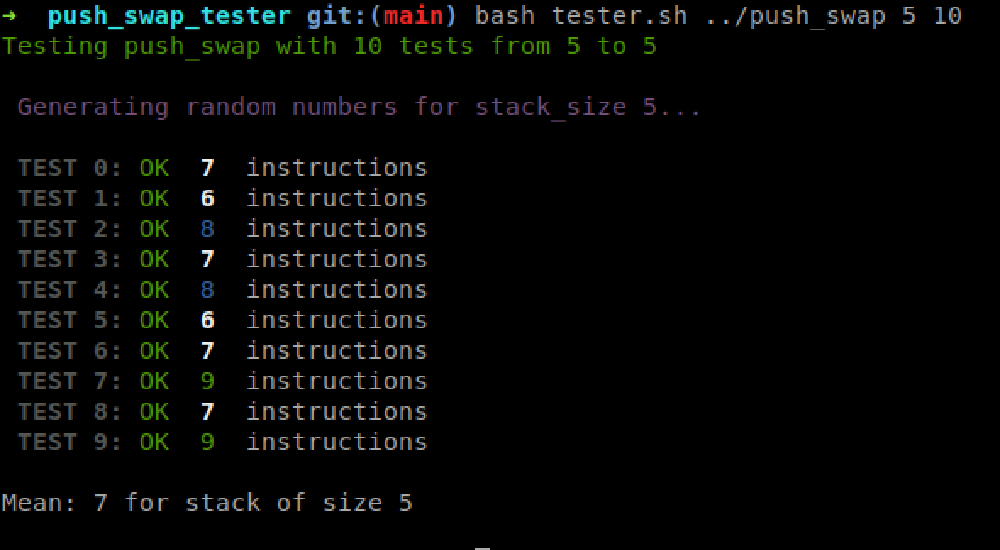

# A tester for Push_swap@42 - To see what's going on
This tester shows the performance of your push_swap program. 

This tester *DOES NOT* check that your checker works correctly.

* [What's push_swap tester?](#whats-push_swap_tester)
* [How do I run this tester?](#how-do-I-run-this-tester)
* [Contribution](#contribution)


## What's push_swap_tester?

Push_swap_tester is a little tester that shows you how your push_swap performs.
It displays the number of instructions performed by your push_swap in color, here is what the colors mean:
```diff
# white means amazing!
@@ blue means good @@
+ green means ok
! orange means really bad
- red means eliminatory
```




## How do I run this tester?

```bash
git clone https://github.com/lmalki-h/push_swap_tester
bash push_swap_tester/tester.sh [path-to-push-swap-dir] [stack-size 0R range] [nb_of_tests]
```
### for example:
the following command will perform 100 testss with a stack of 100 integers
```bash
bash push_swap_tester/tester.sh ../push_swap 100 100
```
   
the following command will perform 100 tests with a stack of 100 integers, then 100 tests with a stack of 101 integers and then 100 tests with a stack of 102 integers
```bash
bash push_swap_tester/tester.sh ../push_swap 100-102 100
```

## Commands

```
USAGE
./push_swap_tester.sh [directory-to-push_swap] [stacksize 0R range] [nb_of_test] {options}

OPTIONS
  --show-arg    Display arguments after the number of instructions.
  --quiet       Don't display arguments if the tester catch an error.
  --retry       Retry with same arguments during the last run or the specified run with --retry=[NUM].
  --score       Show the score of the current entries, useful to compare output of two differents push_swap algo.
  --bench       Use with --score, save the score in push_swap_benchmark.log, if is a new record or a new entries.
                Use --rewrite-bench to erase saved score by the current score.
  --show-index  Display sorted index of each arguments, the index is the offset position when the list is sorted.
  --help/-h     Show this message.
```

## Contribution
If you noticed something wrong with the code or if you'd like to see a new feature, you can submit an issue. If you'd like to contribute please submit a pull request :) 
